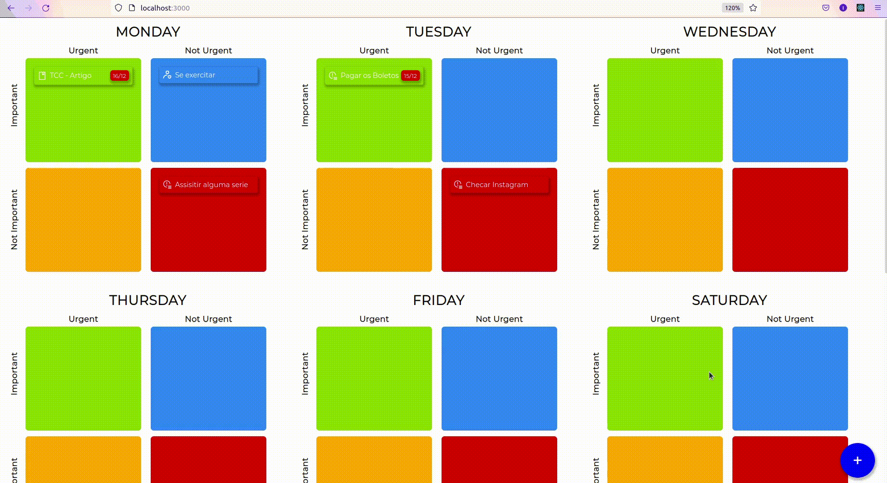

<h1 align="center">
    
    <br>
    <span style = "color: #3178c6; font-weight:bold">Eisenhower's</span> <br><span style = "color: #daa520; font-weight:bold">Matrix APP</span><br>
    Project Portfolio 
</h1>
<h4 align="center">
  A project based in The Eisenhower Matrix, also referred to as Urgent-Important Matrix, helps you decide on and prioritize tasks by urgency and importance, sorting out less urgent and important tasks which you should either delegate or not do at all.
</h4>


<p align="center">
  <a href="#computer-features">Features</a>&nbsp;&nbsp;&nbsp;|&nbsp;&nbsp;&nbsp;
  <a href="#rocket-technologies">Technologies</a>&nbsp;&nbsp;&nbsp;|&nbsp;&nbsp;&nbsp;
  <a href="#information_source-how-to-use">How To Use</a>&nbsp;&nbsp;&nbsp;|&nbsp;&nbsp;&nbsp;
  <a href="#memo-license">License</a>
</p>

<p align="center">
    
</p>

<br>
<p align="center">
  <a href="https://shopapp2020-75c0b.web.app/" target = "_blank" rel="nofollow">
    
  </a>
  <a href="https://www.figma.com/file/6e3bkGOjDfmVehJI9Py4zJ/Matriz-To-do?node-id=0%3A1" target = "_blank" rel="nofollow">
    
  </a>
</p>


## :computer: Features

- Create Tasks
- Drag and drop your task
- Create Todos
- Drag and drop your todos
- Move the modal in the viewport
- Save all datas in the localstorage
- Feel free to test the other features on the [**Live demo**](https://shopapp2020-75c0b.web.app/).

## :rocket: Technologies

This project was developed to improve my knowledges as a FrontEnd Developer and to build this Project I used this technologies:

**FrontEnd**
- [ReactJS](https://reactjs.org/)
- [Typescript](https://www.typescriptlang.org/)

## :information_source: How To Use

To clone and run this application, you'll need [Git](https://git-scm.com), [Node.js][nodejs] + [NPM][npm] installed on your computer.

From your command line:

```bash
# Clone this repository
$ git clone https://github.com/IvanildoPereira/Matrix_App_Typescript.git

# Go into the repository
$ cd Matrix_App_Typescript

# Install dependencies
$ npm install

# Run the app
$ npm start

```

## :memo: License

This project is under the MIT license.

---

Made with ♥ by Ivanildo Pereira :wave: [Get in touch!](https://www.linkedin.com/in/ivanildopconceicao/)

[nodejs]: https://nodejs.org/
[npm]: https://www.npmjs.com/
